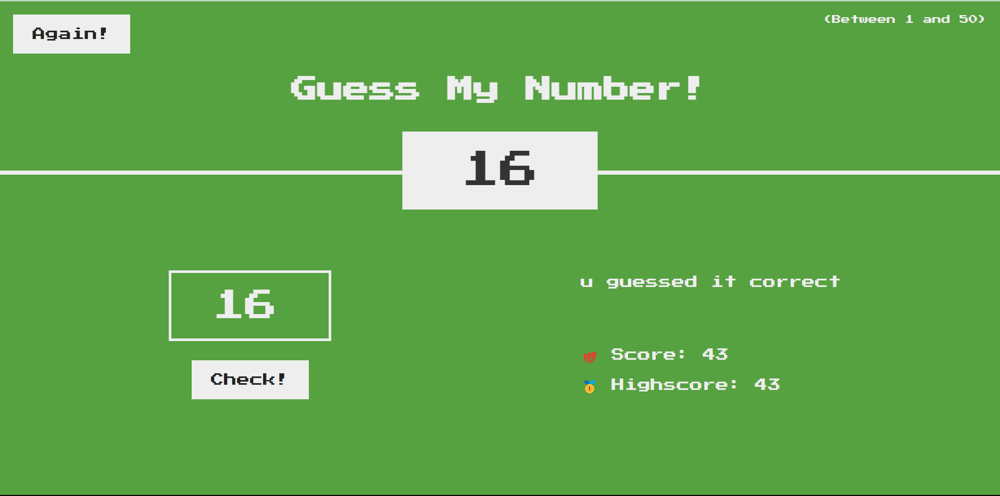

# Guess The Number [Live_demo](https://99dino.github.io/guess-the-number/)

### A simple guessing the number game , implemented with HTML5, CSS3 and Javascript.

- 

### Fun interaction with user to guide them ( giving hint ) by telling how closer they are to guessing the number correctly.

- 

### Rules and Features
+ Enter a valid number b/w 1 to 50.
+ If it says quite low then hidden number is not more than twice the currently guessed number.
+ If it says too low then hidden number is twice more than the currently guessed number.
+ Same formula goes with High feedback.
+ If your score hit 0 then you loses the Game. (Game Over)

#### Fun
+ Can you come up with the strategy such that you dont't have to use all the moves.
